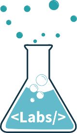

Bienvenidos a **Atarazana Labs**, el programa en el que construiras una Tech Startup a escala mundial, desde la Republica Dominicana!

## Contenidos
* [Requisitos](#requisitos)
* [El programa](#programa)
* [Inversionistas](#inversionistas)
* [Código de conducta](#codigo)

## <a name="requisitos">Quiero ser parte</a>

- Duracion: 6 meses
- Retiros semanales y horas de oficina
- Inversion de capital tipicamente entre US$50,000 - US$100,000 a cambio de 5-10% de Equity
- Asesores fundadores de Startups de gran traccion a nivel mundial
- Mas de 20 inversionistas y asesores en nuestra red
- Espacio de trabajo disponible
- Localidades: Santo Domingo y Cabarete

Si piensas ser parte debes subir via pull request las informaciones que solicitan acerca de tu Startup ;)

## <a name="startup" href="https://github.com/OnilPereyra/atarazanalabs/blob/master/startups/apply.md">Startups</a>

#### Startups que aceptamos

- Internet of things
- Inteligencia Artificial
- Computacion cognitiva
- Vehiculos Autonomos
- Aplicaciones moviles disruptivas
- Fintech

#### Requisitos

- Aceptamos de 1 a tres Startups por batch
- Enfoque en tecnologias disruptivas
- Enfoque en grandes mercados
- Que resuelvan un problema real y que esten en camino a un product market fit
- Equipo con experiencia con al menos un cofundador tecnico y uno de negocios con experiencia en ventas
- Un equipo de tecnlogia solido
- Rapido crecimiento en sus principales KPI's (mayor a 30% mesualmente)
- Ingresos mensuales (GMV) mayores a US$10,000

**Pero por favor mándanos tus sugerencias, estamos abiertos a nuevas y geniales propuestas :)**

## <a name="inversionistas">Informacion para Inversionistas y advisors</a>

#### El programa y beneficios para asesores e inversionistas

- Levantamos capital de inversionistas angeles que hayan previamente fundado una Startup
- Aceptamos asesores con experiencia previa como cofundadores de Startups que hayan levantado mas de US$1M en capital de riesgo
- Tipicamente invertimos US$50,000 - a US$100,000 a cambio de 5 -10% de equity con un retorno de 5 a 10X para los inversionistas
- Los inversionistas no tienen que pagar una membresia

## <a name="codigo" href="https://github.com/OnilPereyra/atarazanalabs/blob/master/docs/codigodeconducta.md">Código de conducta</a>
Cómo todo buen programa, en **Atarazana Labs** también tenemos un código de conducta que todos nuestros Startups deben seguir, si tienes un minuto puedes revisar en el link.

## Licencia
Este proyecto y todos los documentos que en él se encuentran tienen una licencia MIT si no se indica lo contrario.

----------
